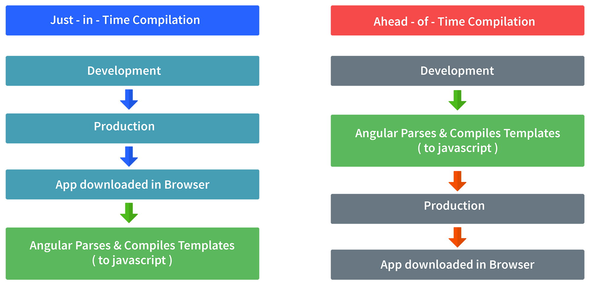
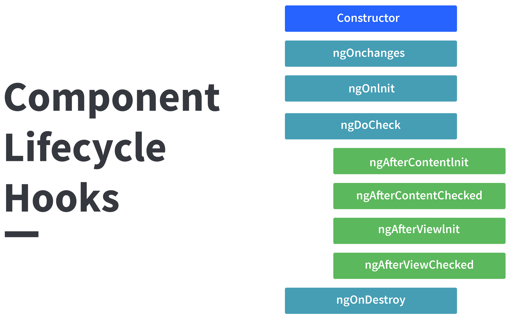
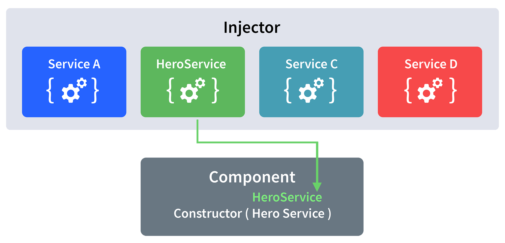

# Angular Interveiw Prep
## Why were client-side frameworks like Angular introduced?
Back in the day, web developers used VanillaJS and jQuery to develop dynamic websites but, as the logic of one's website grew, the code became more and more tedious to maintain. For applications that use complex logic, developers had to put in extra effort to maintain separation of concerns for the app. Also, jQuery did not provide facilities for data handling across views.
For tackling the above problems, client-side frameworks like Angular came into the picture, which made life easier for the developers by handling separation of concerns and dividing code into smaller bits of information (In the case of Angular, called Components).
Client-side frameworks allow one to develop advanced web applications like Single-Page-Application. Not that we cannot develop SPAs using VanillaJS, but by doing so, the development process becomes slower.

## How does an Angular application work?

Every Angular app consists of a file named angular.json. This file will contain all the configurations of the app. While building the app, the builder looks at this file to find the entry point of the application. Following is an image of the angular.json file:

    "build": {
        "builder": "@angular-devkit/build-angular:browser",
        "options": {
          "outputPath": "dist/angular-starter",
          "index": "src/index.html",
          "main": "src/main.ts",
          "polyfills": "src/polyfills.ts",
          "tsConfig": "tsconfig.app.json",
          "aot": false,
          "assets": [
            "src/favicon.ico",
            "src/assets"
          ],
          "styles": [
            "./node_modules/@angular/material/prebuilt-themes/deeppurple-amber.css",
            "src/style.css"
          ]
        }
      }

Inside the build section, the main property of the options object defines the entry point of the application which in this case is main.ts.
The main.ts file creates a browser environment for the application to run, and, along with this, it also calls a function called bootstrapModule, which bootstraps the application. These two steps are performed in the following order inside the main.ts file:

    import { platformBrowserDynamic } from '@angular/platform-browser-dynamic';
    platformBrowserDynamic().bootstrapModule(AppModule)

In the above line of code, AppModule is getting bootstrapped. The AppModule is declared in the app.module.ts file. This module contains declarations of all the components. Below is an example of app.module.ts file:

      import { BrowserModule } from '@angular/platform-browser';
      import { NgModule } from '@angular/core';
      import { AppComponent } from './app.component';

      @NgModule({
        declarations: [
          AppComponent
        ],
        imports: [
          BrowserModule
        ],
        providers: [],
        entryComponents: [],
        bootstrap: [AppComponent]
      })
      export class AppModule { }

As one can see in the above file, AppComponent is getting bootstrapped.
This component is defined in app.component.ts file. This file interacts with the webpage and serves data to it.
Below is an example of app.component.ts file:

      import { Component } from '@angular/core';

      @Component({
        selector: 'app-root',
        templateUrl: './app.component.html',
        styleUrls: ['./app.component.css']
      })
      export class AppComponent {
        title = 'angular';
      }

Each component is declared with three properties:
1. `Selector` - used for accessing the component
2. `Template/TemplateURL` - contains HTML of the component
3. `StylesURL` - contains component-specific stylesheets

After this, Angular calls the index.html file. This file consequently calls the root component that is app-root. The root component is defined in app.component.ts. This is how the index.html file looks:

    <!doctype html>
    <html lang="en">
        <head>
            <meta charset="utf-8">
            <title>Angular</title>
            <base href="/">
            <meta name="viewport" content="width=device-width, initial-scale=1">
        </head>
        <body>
            <app-root></app-root>
        </body>
    </html>

The HTML template of the root component is displayed inside the <app-root> tags. This is how every angular application works.

## What are some of the advantages of Angular over other frameworks?

- Features that are provided out of the box - Angular provides a number of built-in features like,routing, state management, rxjs library and http servicesstraight out of the box. This means that one does not need tolook for the above stated features separately. They are allprovided with angular.
- Declarative UI - Angular uses HTML to render the UI of an application. HTML isa declarative language and is much easier to use than JavaScript.
- Long-term Google support - Google announced Long-term support for Angular. This means that Google plans to stick with Angular and further scale up its ecosystem.

## List out differences between AngularJS and Angula

### Architecture
AngularJS uses MVC or Model-View-Controller architecture, where the Model contains the business logic, Controller processes information and View shows the information present in the Model.

Angular replaces controllers with Components. Components are nothing but directives with a predefined template.

### Language
AngularJS uses JavaScript language, which is a dynamically typed language.
Angular uses TypeScript language, which is a statically typed language and is a superset of JavaScript. By using statically typed language, Angular provides better performance while developing larger applications.

### Mobile Support
AngularJS does not provide mobile support.

Angular is supported by all popular mobile browsers.

### Structure
While developing larger applications, the process of maintaining code becomes tedious in the case of AngularJS.

In the case of Angular, it is easier to maintain code for larger applications as it provides a better structure.

### Expression Syntax
While developing an AngularJS application, a developer needs to remember the correct ng-directive for binding an event, or a property. Whereas in Angular, property binding is done using "[ ]" attribute and event binding is done using "( )" attribute.

## What is AOT compilation? What are the advantages of AOT?
Every Angular application consists of components and templates which the browser cannot understand. Therefore, all the Angular applications need to be compiled first before running inside the browser.

Angular provides two types of compilation:
- JIT(Just-in-Time) compilation
- AOT(Ahead-of-Time) compilation

In JIT compilation, the application compiles inside the browser during runtime. Whereas in the AOT compilation, the application compiles during the build time.

The advantages of using AOT compilation are:
- Since the application compiles before running inside the browser, the browser loads the executable code and renders the application immediately, which leads to faster rendering.
- In AOT compilation, the compiler sends the external HTML and CSS files along with the application, eliminating separate AJAX requests for those source files, which leads to fewer ajax requests.
- Developers can detect and handle errors during the building phase, which helps in minimizing errors.
- The AOT compiler adds HTML and templates into the JS files before they run inside the browser. Due to this, there are no extra HTML files to be read, which provide better security to the application.

By default, angular builds and serves the application using JIT compiler:

    ng build
    ng serve

For using AOT compiler following changes should be made:    

    ng build --aot
    ng serve --aot

### Explain Components, Modules and Services in Angular

#### Components
In Angular, components are the basic building blocks, which control a part of the UI for any application.

A component is defined using the @Component decorator. Every component consists of three parts, the template which loads the view for the component, a stylesheet which defines the look and feel for the component, and a class that contains the business logic for the component.

      import { Component, OnInit } from '@angular/core';

      @Component({
        selector: 'app-test',
        templateUrl: './test.component.html',
        styleUrls: ['./test.component.css']
      })
      export lass TestComponent implements OnInit {

        constructor() {}

        ngOnInit() {
        }
      }

#### Modules
A module is a place where we can group components, directives, services, and pipes. Module decides whether the components, directives, etc can be used by other modules, by exporting or hiding these elements. Every module is defined with a @NgModule decorator.

By default, modules are of two types:
- Root Module
- Feature Module

Every application can have only one root module whereas, it can have one or more feature modules. A root module imports BrowserModule, whereas a feature module imports CommonModule.

Root module

      import { BrowserModule } from '@angular/platform-browser';
      import { NgModule } from '@angular/core';

      import { AppComponent } from './app.component';
      import { TestComponent } from './test/text.component';

      @NgModule({
        declarations: [
          AppComponent,
          TestComponent
        ],
        imports: [
          BrowserModule
        ],
        providers: [],
        bootstrap: [AppComponent]
      })
      export class AppModule { }

Feature Module

      import { NgModule } from '@angular/core';
      import { CommonModule } from '@angular/common';

      @NgModule({
        declarations: [],
        imports: [
          CommonModule
        ]
      })
      export class TestModuleModule { }

#### Services 
Services are objects which get instantiated only once during the lifetime of an application. The main objective of a service is to share data, functions with different components of an Angular application. A service is defined using a @Injectable decorator. A function defined inside a service can be invoked from any component or directive.

      import { Injectable } from '@angular/core';

      @Injectable({
        providedIn: 'root'
      })
      export class TestServiceService {

        constructor() { }

      }

## What are lifecycle hooks in Angular? Explain a few lifecycle hooks.
Every component in Angular has a lifecycle, different phases it goes through from the time of creation to the time it's destroyed. Angular provides hooks to tap into these phases and trigger changes at specific phases in a lifecycle.

### ngOnChanges( ) 
This hook/method is called before ngOnInit and whenever one or more input properties of the component changes.
This method/hook receives a SimpleChanges object which contains the previous and current values of the property.

### ngOnInit( ) 
This hook gets called once, after the ngOnChanges hook.
It initializes the component and sets the input properties of the component.

### ngDoCheck( )
It gets called after ngOnChanges and ngOnInit and is used to detect and act on changes that cannot be detected by Angular.
We can implement our change detection algorithm in this hook. 

### ngAfterContentInit( ) 
It gets called after the first ngDoCheck hook. This hook responds after the content gets projected inside the component.

### ngAfterContentChecked( ) 
It gets called after ngAfterContentInit and every subsequent ngDoCheck. It responds after the projected content is checked.

### ngAfterViewInit( )
It responds after a component's view, or a child component's view is initialized.

### ngAfterViewInit( ) 
It responds after a component's view, or a child component's view is initialized.

### ngAfterViewChecked( ) 
It gets called after ngAfterViewInit, and it responds after the component's view, or the child component's view is checked.

### ngOnDestroy( ) 
It gets called just before Angular destroys the component. This hook can be used to clean up the code and detach event handlers.

## Explain string interpolation and property binding in Angular.

String interpolation and property binding are parts of data-binding in Angular.

Data-binding is a feature in angular, which provides a way to communicate between the component(Model) and its view(HTML template).

Data-binding can be done in two ways, one-way binding and two-way binding.

In Angular, data from the component can be inserted inside the HTML template. In one-way binding, any changes in the component will directly reflect inside the HTML template but, vice-versa is not possible. Whereas, it is possible in two-way binding.

String interpolation and property binding allow only one-way data binding.

String interpolation uses the double curly braces {{ }} to display data from the component. Angular automatically runs the expression written inside the curly braces, for example, {{ 2 + 2 }} will be evaluated by Angular and the output 4, will be displayed inside the HTML template. Using property binding, we can bind the DOM properties of an HTML element to a component's property. Property binding uses the square brackets [ ] syntax.

## How are Angular expressions different from JavaScript expressions?
The first and perhaps, the biggest difference is that Angular expressions allow us to write JavaScript in HTML which is not the case when it comes to JavaScript expressions.

Next, Angular expressions are evaluated against a local scope object whereas JavaScript expressions against global window object. Let's understand that better with an example :

Consider the following component named test:

      import { Component, OnInit } from '@angular/core';

      @Component({
        selector: 'app-test',
        template: `
            <h4>{{message}}</h4>
        `,
        styleUrls: ['./test.component.css']
      })
      export class TestComponent implements OnInit {
        message:string = “Hello world”;
        constructor() { }

        ngOnInit() {
        }
      }

As one can see that Angular expression is used to display message property of a component. Since we are using Angular expressions, in the present template, we cannot access a property outside of its local scope, which in this case is TestComponent.

This proves that Angular expressions are always evaluated based on scope object rather than the global object.

Next difference is how Angular expressions handle null and undefined.

Consider the following JavaScript example:

      <!DOCTYPE html>
      <html lang="en">
      <head>
          <meta charset="UTF-8">
          <meta name="viewport" content="width=device-width, initial-scale=1.0">
          <title>JavaScript Test</title>
      </head>
      <body>
          

      </body>
      
      </html>

If you run the above code, you will see undefined displayed on the screen. Although it’s not ideal to leave any property undefined, the user does not need to see this.

Now consider the following Angular example:

      import { Component, OnInit } from '@angular/core';

      @Component({
        selector: 'app-new',
        template: `
            <h4>{{message}}</h4>
        `,
        styleUrls: ['./new.component.css']
      })
      export class NewComponent implements OnInit {
        message:object = {};
        constructor() { }

        ngOnInit() {
        }

      }

If you render the above component, you will not see undefined being displayed on the screen.

Next, in Angular expressions one cannot use loops, conditionals and exceptions.

The difference which makes Angular expressions quite beneficial is the use of pipes. Angular uses pipes(called filters in AngularJS), which can be used to format data before displaying it. Let’s see one predefined pipe in action:

      import { Component, OnInit } from '@angular/core';

      @Component({
        selector: 'app-new',
        template: `
            <h4>{{message | lowercase}}</h4>
        `,
        styleUrls: ['./new.component.css']
      })
      export class NewComponent implements OnInit {
        message:string = "HELLO WORLD";
        constructor() { }

        ngOnInit() {
        }
      }

In the above code we have used a predefined pipe called lowercase, which transforms all the letters in lowercase. Therefore, if you render the above component, you will see “hello world” being displayed.

In contrast, JavaScript does not have the concept of pipes.

## How are observables different from promises?

The first difference is that an Observable is lazy whereas a Promise is eager.

| Promise | Observable |
| --- | ----------- |
| Emits a single value | Emits multiple values over a period of time |
| Not Lazy | Lazy. An observable is not called until we subscribe to the observable |
| Cannot be cancelled | Can be cancelled by using the unsubscribe() method |
|  | Observable provides operators like map, forEach, filter, reduce, retry, retryWhen etc. |

Consider the following Observable:

      const observable = rxjs.Observable.create(observer => {
        console.log('Text inside an observable');
        observer.next('Hello world!');
        observer.complete();
      });

      console.log('Before subscribing an Observable');

      observable.subscribe((message)=> console.log(message));

When you run the above Observable, you can see messages being displayed in the following order:

    Before subscribing an Observable
    Text inside an observable
    Hello world!

As you can see, observables are lazy. Observable runs only when someone subscribes to them hence, the message “Before subscribing…” is displayed ahead of the message inside the observable.

Now let’s consider a Promise:

      const promise = new Promise((resolve, reject) => {
        console.log('Text inside promise');
        resolve('Hello world!');
      });

      console.log('Before calling then method on Promise');

      greetingPoster.then(message => console.log(message));

Running the above promise, the messages will be displayed in the following order:

    Text inside promise
    Before calling then method on Promise
    Hello world!

As you can see the message inside Promise is displayed first. This means that a promise runs before the then method is called. Therefore, promises are eager.

The next difference is that Promises are always asynchronous. Even when the promise is immediately resolved. Whereas an Observable, can be both synchronous and asynchronous.

The next difference is that Observables can emit multiple values whereas Promises can emit only one value.

The biggest feature of using observables is the use of operators. We can use multiple operators on an observable whereas, there is no such feature in a promise.

## Angular by default, uses client-side rendering for its applications.
Can one make an angular application to render on the server-side?
Yes, angular provides a technology called Angular Universal, which can be used to render applications on the server-side.

The advantages of using Angular Universal are :

First time users can instantly see a view of the application. This benefits in providing better user experience.
Many search engines expect pages in plain HTML, thus, Universal can make sure that your content is available on every search engine, which leads to better SEO.
Any server-side rendered application loads faster since rendered pages are available to the browser sooner.

## What are directives in Angular?
A directive is a class in Angular that is declared with a @Directive decorator.
Every directive has its own behaviour and can be imported into various components of an application.

### When to use a directive?
Consider an application, where multiple components need to have similar functionalities. The norm thing to do is by adding this functionality individually to every component but, this task is tedious to perform. In such a situation, one can create a directive having the required functionality and then, import the directive to components which require this functionality.

### Types of directives
#### Component directives
These form the main class in directives. Instead of @Directive decorator we use @Component decorator to declare these directives. These directives have a view, a stylesheet and a selector property.

#### Structural directives
These directives are generally used to manipulate DOM elements.
Every structural directive has a ‘ * ’ sign before them.
We can apply these directives to any DOM element.

Let’s see some built-in structural directives in action:

      

          {{name}}
      

      

          
{{x.name}}

          
 {{x.address}}

          
{{x.age}}

      

In the above example, we can *ngIf and *ngFor directives being used.

*ngIf is used to check a boolean value and if it’s truthy,the div element will be displayed.

*ngFor is used to iterate over a list and display each item of the list.

#### Attribute Directives
These directives are used to change the look and behaviour of a DOM element. Let’s understand attribute directives by creating one: 

      import { Directive, ElementRef } from '@angular/core';

      @Directive({
       selector: '[appBlueBackground]'
      })
      export class BlueBackgroundDirective {
       constructor(el:ElementRef) {
         el.nativeElement.style.backgroundColor = "blue";
       }
      }

Now we can apply the above directive to any DOM element:

      
Hello World!

## How does one share data between components in Angular?

Following are the commonly used methods by which one can pass data between components in angular:

### Parent to child using @Input decorator

      @Component({
        selector: 'app-parent',
        template: `
          <app-child [data]=data></app-child>
        ` ,
        styleUrls: ['./parent.component.css']
      })
      export class ParentComponent{
        data:string = "Message from parent";
        constructor() { }
      }

In the above parent component, we are passing “data” property to the following child component:

      import { Component, Input} from '@angular/core';

      @Component({
        selector: 'app-child',
        template:`
          
{{data}}

        `,
        styleUrls: ['./child.component.css']
      })
      export class ChildComponent {
        @Input() data:string
        constructor() { }
      }

In the child component, we are using @Input decorator to capture data coming from a parent component and using it inside the child component’s template.

### Child to parent using @ViewChild decorator
Child component:

      import {Component} from '@angular/core';

      @Component({
        selector: 'app-child',
        template:`
          
{{data}}

        `,
        styleUrls: ['./child.component.css']
      })
      export class ChildComponent {
        data:string = "Message from child to parent";
        constructor() { }
      }

Parent Component

      import { Component,ViewChild, AfterViewInit} from '@angular/core';
      import { ChildComponent } from './../child/child.component';

      @Component({
        selector: 'app-parent',
        template: `
          
{{dataFromChild}}

        ` ,
        styleUrls: ['./parent.component.css']
      })
      export class ParentComponent implements AfterViewInit {
        dataFromChild: string;
        @ViewChild(ChildComponent,{static:false}) child;

        ngAfterViewInit(){
          this.dataFromChild = this.child.data;
        }
        constructor() { }
      }

In the above example, a property named “data” is passed from the child component to the parent component.

@ViewChild decorator is used to reference the child component as “child” property.
Using the ngAfterViewInit hook, we assign the child’s data property to the messageFromChild property and use it in the parent component’s template.

### Child to parent using @Output and EventEmitter
In this method, we bind a DOM element inside the child component, to an event ( click event for example ) and using this event we emit data that will captured by the parent component:

Child Component:

      import {Component, Output, EventEmitter} from '@angular/core';

      @Component({
        selector: 'app-child',
        template:`
          <button (click)="emitData()">Click to emit data</button>
        `,
        styleUrls: ['./child.component.css']
      })
      export class ChildComponent {

        data:string = "Message from child to parent";

        @Output() dataEvent = new EventEmitter<string>();

        constructor() { }

        emitData(){
          this.dataEvent.emit(this.data);
        }
      }

As you can see in the child component, we have used @Output property to bind an EventEmitter. This event emitter emits data when the button in the template is clicked.

In the parent component’s template we can capture the emitted data like this:

      <app-child (dataEvent)="receiveData($event)"></app-child>

Then inside the receiveData function we can handle the emitted data:

      receiveData($event){
        this.dataFromChild = $event;
      }

## Explain the concept of Dependency Injection?
Dependency injection is an application design pattern which is implemented by Angular.
It also forms one of the core concepts of Angular.

### So what is dependency injection in simple terms?
Let’s break it down, dependencies in angular are nothing but services which have a functionality. Functionality of a service, can be needed by various components and directives in an application. Angular provides a smooth mechanism by which we can inject these dependencies in our components and directives.

So basically, we are just making dependencies which are injectable across all components of an application.

Let’s understand how DI (Dependency Injection) works:

      import { Injectable } from '@angular/core';

      @Injectable({
        providedIn: 'root'
      })
      export class TestService {
        importantValue:number = 42;

        constructor() { }

        returnImportantValue(){
          return this.importantValue;
        }
      }

As one can notice, we can create injectable dependencies by adding the @Injectable decorator to a class.

We inject the above dependency inside the following component:

      import { TestService } from './../test.service';
      import { Component, OnInit } from '@angular/core';

      @Component({
        selector: 'app-test',
        templateUrl: './test.component.html',
        styleUrls: ['./test.component.css']
      })
      export class TestComponent implements OnInit {
        value:number;
        constructor(private testService:TestService) { }

        ngOnInit() {
          this.value = this.testService.returnImportantValue();
        }
      }

One can see we have imported our TestService at the top of the page. Then, we have created an instance inside the constructor of the component and implemented the returnImportantValue function of the service.

From the above example, we can observe how angular provides a smooth way to inject dependencies in any component.

## Explain MVVM architecture
MVVM architecture consists of three parts:
1. Model
2. View
3. ViewModel

Model contains the structure of an entity. In simple terms it contains data of an object.

View is the visual layer of the application. It displays the data contained inside the Model. In angular terms, this will be the HTML template of a component.

ViewModel is an abstract layer of the application. A viewmodel handles the logic of the application. It manages the data of a model and displays it in the view.

View and ViewModel are connected with data-binding (two-way data-binding in this case). Any change in the view, the viewmodel takes a note and changes the appropriate data inside the model.

## What are decorators in Angular? 
Decorators are a design pattern or functions that define how Angular features work. They are used to make prior modifications to a class, service, or filter. Angular supports four types of decorators, they are:

- Class Decorators
- Property Decorators
- Method Decorators
- Parameter Decorators

## What are filters in Angular? Name a few of them.
Filters are used to format an expression and present it to the user. They can be used in view templates, controllers, or services. Some inbuilt filters are as follows. 

- date - Format a date to a specified format.
- filter - Select a subset of items from an array.
- Json - Format an object to a JSON string.
- limitTo -  Limits an array/string, into a specified number of elements/characters.
- lowercase - Format a string to lowercase.

## What is view encapsulation in Angular?
View encapsulation defines whether the template and styles defined within the component can affect the whole application or vice versa. Angular provides three encapsulation strategies:

- Emulated - styles from the main HTML propagate to the component.
- Native - styles from the main HTML do not propagate to the component. 
- None - styles from the component propagate back to the main HTML and therefore are visible to all components on the page.

## What are Template and Reactive forms?
### Template-driven approach
- In this method, the conventional form tag is used to create forms. Angular automatically interprets and creates a form object representation for the tag. 
- Controls can be added to the form using the NGModel tag. Multiple controls can be grouped using the NGControlGroup module. 
- A form value can be generated using the “form.value” object. Form data is exported as JSON values when the submit method is called. 
- Basic HTML validations can be used to validate the form fields. In the case of custom validations, directives can be used. 
- Arguably, this method is the simplest way to create an Angular App. 

### Reactive Form Approach
- This approach is the programming paradigm oriented around data flows and propagation of change. 
- With Reactive forms, the component directly manages the data flows between the form controls and the data models. 
- Reactive forms are code-driven, unlike the template-driven approach. 
- Reactive forms break from the traditional declarative approach. 
- Reactive forms eliminate the anti-pattern of updating the data model via two-way data binding.
- Typically, Reactive form control creation is synchronous and can be unit tested with synchronous programming techniques. 