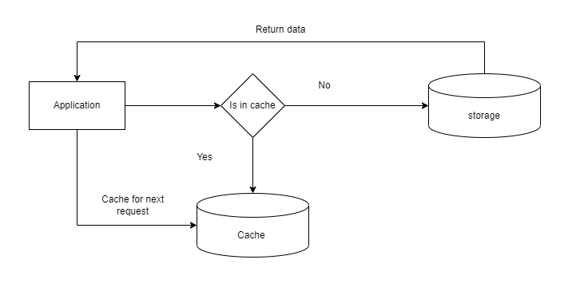
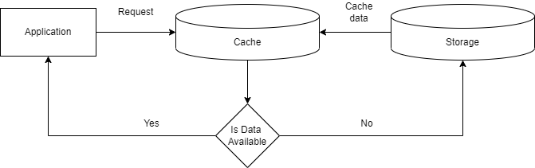
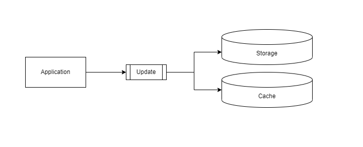
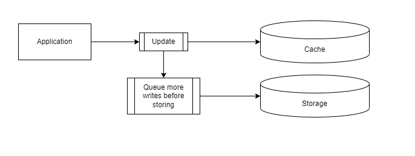

# Cache

## What is cache?

A cache is a hardware or software component that stores data so that future requests for that data can be served faster; the data stored in a cache might be the result of an earlier computation or a copy of data stored elsewhere. A cache hit occurs when the requested data can be found in a cache, while a cache miss occurs when it cannot. Cache hits are served by reading data from the cache, which is faster than recomputing a result or reading from a slower data store; thus, the more requests that can be served from the cache, the faster the system performs.

## Why use cache?
- In-memory data lookup
- RDBMS Speedup
- Manage Spike in web/mobile apps
- Session Store
- Token Caching
- Gaming
- Web Page Cachin
- Global Id or Counter generation
- Fast Access To Any Suitable Data

## Caching strategies

### Cache Aside

Pros:    
- Cache only what's needed

Cons:
- Cache misses are expensive
- Data staleness
- Implementation complexity

### Read Through

Load data into the cache only when necessary. If application needs data for some key x, search in the cache first. If data is present, return the data, otherwise, retrieve the data from data source, put it into the cache & then return.

Advantages:

- It does not load or hold all the data together, it’s on demand. Suitable for cases when you know that your application might not need to cache all data from data source in a particular category.
- If there are multiple such cache nodes & a node fails, it does not harm the application although in such situation, the application faces increased latency. As new cache node comes up online, more & more request flows through it & it keeps populating required data with every cache miss.

Disadvantages:

- For cache miss, there are 3 network round trips. Check in the cache, retrieve from database, pour the data into the cache. So cache causes noticeable delay in the response.
- Stale data might become an issue. If data changes in the database & the cache key is not expired yet, it will throw stale data to the application.

### Write Through

While inserting or updating data in the database, upsert the data in the cache as well. So both of these operations should occur in a single transaction otherwise data staleness will be there.

Advantages:

- No stale data. It addresses the staleness issue of Read Through cache.
- Suitable for read heavy systems which can’t much tolerate staleness.

Disadvantages:

- It’s a write penalty system. Every write operation does 2 network operations — write data to data source, then write to cache.
- Cache churn: If most of the data is never read, cache will unnecessarily host useless data. This can be controlled by using TTL or expiry.
- In order to maintain the consistency between cache & data source, while writing a data, if any of your cache node goes missing, the write operation fails altogether.
 
### Write Behind

In this strategy, the application writes data directly to the caching system. Then after a certain configured interval, the written data is asynchronously synced to the underlying data source. So here the caching service has to maintain a queue of ‘write’ operations so that they can be synced in order of insertion.

Advantages:

- Since the application writes only to the caching service, it does not need to wait till data is written to the underlying data source. Read and write both happens at the caching side. Thus it improves performance.
- The application is insulated from database failure. If database fails, queued items can be retried or re-queued.
- Suitable for high read & write throughput system.

Disadvantages:

- Eventual consistency between database & caching system. So any direct operation on database or joining operation may use stale data.

## Cache eviction policies

### First in first out

It’s more of like MRU but it follows strict ordering of inserted data items. MRU does not honour insertion order.

### Least recently used

  One of the most used strategies is LRU. In most caching use cases, applications access the same data again & again. Say in any Google search engine, when you search for something, you will get the same results again & again at least for some time window. When you search flights or bus or train, you get the same routes unless & until some route gets deactivated or fully reserved. In such use cases, the cached data that is not used very recently or sort of cold data can be safely evicted.

Advantages:
- Is nearest to the most optimal algorithm
- Selects and removes elements that are not used recently

Disadvantages:
- Only mild success rate since often it is more important how often an element was accessed than when it was last accessed

### Least frequently used

Advantages:
- Takes age of the element into account
- Takes reference frequency of the element into account
- Works better under high load when quickly a lot of elements is requested (less false eviction)

Disadvantages:
- A frequently accessed element will only be evicted after lots of misses
- More important to have invalidation on elements that can change

### Most recently used

This strategy removes most recently used items as they are not required at least in the near future.
