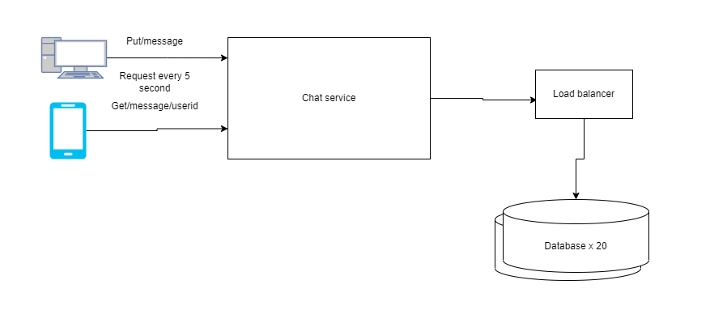

# Design a chat (aka whatsapp)

## Questioning the requirement, Thinking out loud.
- How many active users - 100M 
- How many chats at the same time - 1M
- How many messages per day - 1B
- What platforms - Both
- Do we need group chats - No

## Basic Design

## DB design
- User - user_name, email, etc
- Messages - from_user, to_user, message, time_stamp

## Indexing 

We can index user_name, email from the user table, as we will be getting user list a lot with mostly these field, and from_user, to_user from messages table as will get message mostly by this. message is not required if we are not planning on implementing a search message functionality, in which case we might index that too.

## Identifying bottlenecks

As we have: 
- 1,000,000,000 a day.
- 1,000,000,000 / 24 = 41,666,666.66 or 40M message per hour
- 40,000,000 / 60 =  666,666.66 or 700K message per minute
- 700,000 / 60 = 11,666.66 or 12k message per minute

Refreshing chat every 5 second: 
- 1,000,000,000 * (60/5) / 60 = 200,000,000 or 200k reads for sec

So we can have 12k writes, and 200k reads per second. We can handle writes on a single instance of a database if its large enough but 200k reads is pretty bad. We can start by scaling the reads of our system.

We can start off by changing our protocols. Instead of refreshing every 5 second using the usual http protocol we can change to websocket, that will intially connect to the websocket and wait for server to send updates. So the initial call load can be reduceds. But it will still have the issue of 200k reads/s on a single instance of a database.

Lets assume that a single instance of a database can handle 10k reads. So we will need 20 instances of a database which will be put behind a load balancer.

But the issue with that is, the write overhead of writing to 20 replicas. Also the cost of replicating 20 databases. So instead of replicas we can shard our database.

We can shard the database by apending users. So if, joker messages batman the data will be stored in joker-batman databse. But the problem with this is we if we do it the other way around, batman-joker will end up in another shard. To solve this problem we can do a sort before appending user this way both will end up in joker-batman database.

We should also put a load balancer infront of our chat service and replicate chat service. The load balancer can then round robin every request to the services to ease load on a single instance of the service.