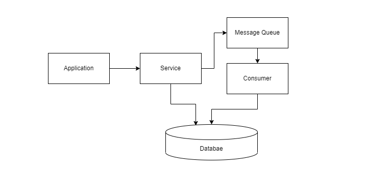

# Queue

Message queuing makes it possible for applications to communicate asynchronously, by sending messages to each other via a queue. A message queue provides temporary storage between the sender and the receiver so that the sender can keep operating without interruption when the destination program is busy or not connected. Asynchronous processing allows a task to call a service, and move on to the next task while the service processes the request at its own pace.

## The role of message queuing in a microservice architecture

- In a microservice architecture, there are different functionalities divided across different services, that offer various functionalities. These services are coupled together to form a complete software application.

- Typically, in a microservice architecture, there are cross-dependencies, which entail that no single service can perform its functionalities without getting help from other services. This is where it’s crucial for your system to have a mechanism in place which allows services to keep in touch with each other without getting blocked by responses.

- Message queuing fulfills this purpose by providing a means for services to push messages to a queue asynchronously and ensure that they get delivered to the correct destination. To implement a message queue between services, you need a message broker, think of it as a mailman, who takes mail from a sender and delivers it to the correct destination.

## Message Broker — RabbitMQ

RabbitMQ is one of the most widely used message brokers, it acts as the message broker, “the mailman”, a microservice architecture needs.

RabbitMQ consists of:

1. producer — the client that creates a message
2. consumer — receives a message
3. queue — stores messages
3. exchange — enables to route messages and send them to queues
