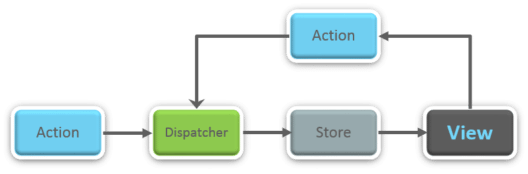
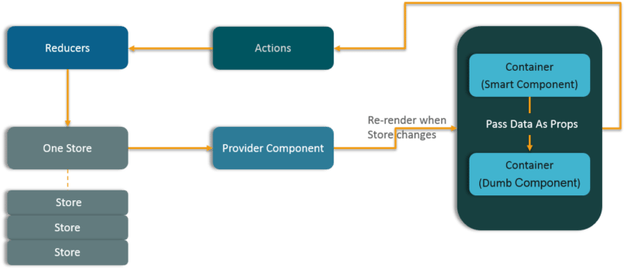

# React Interview Prep

## What is React? 
- React is a front-end JavaScript library developed by Facebook in 2011.
- It follows the component based approach which helps in building reusable UI components.
- It is used for developing complex and interactive web and mobile UI.
- Even though it was open-sourced only in 2015, it has one of the largest communities supporting it.

## Differentiate between Real DOM and Virtual DOM.

| Real DOM | Virtual DOM |
| --- | ----------- |
| It updates slow.| It updates faster.|
|Can directly update HTML | Can't directly update HTML. |
|Creates a new dom if element updates. | Updatese the JSX if element update |
|Dom manipulation is very expensive | DOM manipulation is very easy | 
| Too much of memory wastage | No memory wastage | 

## What are the features of React? 

- It uses the virtual DOM instead of the real DOM.
- It uses server-side rendering.
- It follows uni-directional data flow or data binding.

## List some of the major advantages of React.

- It increases the application’s performance
- It can be conveniently used on the client as well as server side
- Because of JSX, code’s readability increases
- React is easy to integrate with other frameworks like Meteor, Angular, etc
- Using React, writing UI test cases become extremely easy

## What are the limitations of React?

- React is just a library, not a full-blown framework
- Its library is very large and takes time to understand
- It can be little difficult for the novice programmers to understand
- Coding gets complex as it uses inline templating and JSX

##  What is JSX?

JSX is a shorthand for JavaScript XML. This is a type of file used by React which utilizes the expressiveness of JavaScript along with HTML like template syntax. This makes the HTML file really easy to understand. This file makes applications robust and boosts its performance. Below is an example of JSX:

    render(){
        return(                
            
                    
                <h1> Hello World from Edureka!!</h1>        
            

        );
    }

## What do you understand by Virtual DOM? Explain its works.

A virtual DOM is a lightweight JavaScript object which originally is just a copy of the real DOM. It is a node tree that lists the elements, their attributes and content as Objects and their properties. React’s render function creates a node tree out of the React components. It then updates this tree in response to the mutations in the data model which is caused by various actions done by the user or by the system.

This Virtual DOM works in three simple steps.

- Whenever any underlying data changes, the entire UI is re-rendered in Virtual DOM representation.

- Then the difference between the previous DOM representation and the new one is calculated.

- Once the calculations are done, the real DOM will be updated with only the things that have actually changed. 

## Why can’t browsers read JSX?

Browsers can only read JavaScript objects but JSX in not a regular JavaScript object. Thus to enable a browser to read JSX, first, we need to transform JSX file into a JavaScript object using JSX transformers like Babel and then pass it to the browser.

## How different is React’s ES6 syntax when compared to ES5?

- require vs import

        // ES5
        var React = require('react');
    
        // ES6
        import React from 'react';

- export vs exports

        // ES5
        module.exports = Component;
 
        // ES6
        export default Component;

- component and function

        // ES5
        var MyComponent = React.createClass({
            render: function() {
                return
        
        <h3>Hello Edureka!</h3>
        ;
            }
        });
        
        // ES6
        class MyComponent extends React.Component {
            render() {
                return
        
        <h3>Hello Edureka!</h3>
        ;
            }
        }

- props

        // ES5
        var App = React.createClass({
            propTypes: { name: React.PropTypes.string },
            render: function() {
                return
        
        <h3>Hello, {this.props.name}!</h3>
        ;
            }
        });
        
        // ES6
        class App extends React.Component {
            render() {
                return
        
        <h3>Hello, {this.props.name}!</h3>
        ;
            }
        }

- state

        // ES5
        var App = React.createClass({
            getInitialState: function() {
                return { name: 'world' };
            },
            render: function() {
                return
        
        <h3>Hello, {this.state.name}!</h3>
        ;
            }
        });
        
        // ES6
        class App extends React.Component {
            constructor() {
                super();
                this.state = { name: 'world' };
            }
            render() {
                return
        
        <h3>Hello, {this.state.name}!</h3>
        ;
            }
        }

## How is React different from Angular?

| Topic | React | Angular |
| ----- | ----- | ------- |
| ARCHITECTURE | Only the View of MVC | Complete MVC | 
| RENDERING	| Server-side rendering | Client-side rendering |
|  DOM | Uses virtual DOM | Uses real DOM | 
| DATA BINDING | One-way data binding | Two-way data binding | 
| DEBUGGING	| Compile time debugging | Runtime debugging |
|  AUTHOR | Facebook | Google | 

## “In React, everything is a component.” Explain.

Components are the building blocks of a React application’s UI. These components split up the entire UI into small independent and reusable pieces. Then it renders each of these components independent of each other without affecting the rest of the UI.

## What is the purpose of render() in React.

Each React component must have a render() mandatorily. It returns a single React element which is the representation of the native DOM component. If more than one HTML element needs to be rendered, then they must be grouped together inside one enclosing tag such as form, group,div etc. This function must be kept pure i.e., it must return the same result each time it is invoked.

## How can you embed two or more components into one?

    class MyComponent extends React.Component{
        render(){
            return(          
                

                    <h1>Hello</h1>
                    <Header/>
                

            );
        }
    }
    class Header extends React.Component{
        render(){
            return
                <h1>Header Component</h1>
        };
    }
    ReactDOM.render(
        <MyComponent/>, document.getElementById('content')
    );

## What is Props?

Props is the shorthand for Properties in React. They are read-only components which must be kept pure i.e. immutable. They are always passed down from the parent to the child components throughout the application. A child component can never send a prop back to the parent component. This help in maintaining the unidirectional data flow and are generally used to render the dynamically generated data.

## What is a state in React and how is it used?

States are the heart of React components. States are the source of data and must be kept as simple as possible. Basically, states are the objects which determine components rendering and behavior. They are mutable unlike the props and create dynamic and interactive components. They are accessed via this.state().

## Differentiate between states and props.

| Conditions | State | Props |
| ---------- | ----- | ----- |
| Receive initial value from parent component |	Yes | Yes | 
| Parent component can change value	| No | Yes |
| Set default values inside component | Yes | Yes |
| Changes inside component | Yes| No |
| Set initial value for child components | Yes | Yes |
| Changes inside child components | No | Yes | 

## How can you update the state of a component?

State of a component can be updated using this.setState().

## What is arrow function in React? How is it used?

Arrow functions are more of brief syntax for writing the function expression. They are also called ‘fat arrow‘ (=>) the functions. These functions allow to bind the context of the components properly since in ES6 auto binding is not available by default. Arrow functions are mostly useful while working with the higher order functions.

    //General way
    render() {    
        return(
            <MyInput onChange={this.handleChange.bind(this) } />
        );
    }
    //With Arrow Function
    render() {  
        return(
            <MyInput onChange={ (e) => this.handleOnChange(e) } />
        );
    }

## Differentiate between stateful and stateless components.

| Stateful Component | Stateless Component | 
| ------------------ | ------------------- |
| Stores info about component’s state change in memory | Calculates the internal state of the components | 
| Have authority to change state | Do not have the authority to change state | 
| Contains the knowledge of past, current and possible future changes in state | Contains no knowledge of past, current and possible future state changes | 
| Stateless components notify them about the requirement of the state change, then they send down the props to them. |  They receive the props from the Stateful components and treat them as callback functions. | 

## What are the different phases of React component’s lifecycle?
There are three different phases of React component’s lifecycle:

- `Initial Rendering Phase`: This is the phase when the component is about to start its life journey and make its way to the DOM.
- `Updating Phase`: Once the component gets added to the DOM, it can potentially update and re-render only when a prop or state change occurs. That happens only in this phase.
- `Unmounting Phase`: This is the final phase of a component’s life cycle in which the component is destroyed and removed from the DOM.

## Explain the lifecycle methods of React components in detail.

Some of the most important lifecycle methods are:

- `componentWillMount()` – Executed just before rendering takes place both on the client as well as server-side.
- `componentDidMount()` – Executed on the client side only after the first render.
- `componentWillReceiveProps()` – Invoked as soon as the props are received from the parent class and before another render is called.
- `shouldComponentUpdate()` – Returns true or false value based on certain conditions. If you want your component to update, return true else return false. By default, it returns true.
- `componentWillUpdate()` – Called just before rendering takes place in the DOM.
- `componentDidUpdate()` – Called immediately after rendering takes place.
- `componentWillUnmount()` – Called after the component is unmounted from the DOM. It - is used to clear up the memory spaces.

## What is an event in React?

In React, events are the triggered reactions to specific actions like mouse hover, mouse click, key press, etc. Handling these events are similar to handling events in DOM elements. But there are some syntactical differences like:

- Events are named using camel case instead of just using the lowercase.
- Events are passed as functions instead of strings.

The event argument contains a set of properties, which are specific to an event. Each event type contains its own properties and behavior which can be accessed via its event handler only.

## How do you create an event in React?

    class Display extends React.Component({    
        show(evt) {
            // code   
        },   
        render() {      
            // Render the div with an onClick prop (value is a function)        
            return (            
            
    
Click Me!

    
            );    
        }
    });

## What are synthetic events in React?

Synthetic events are the objects which act as a cross-browser wrapper around the browser’s native event. They combine the behavior of different browsers into one API. This is done to make sure that the events show consistent properties across different browsers.

## What do you understand by refs in React?

Refs is the short hand for References in React. It is an attribute which helps to store a reference to a particular React element or component, which will be returned by the components render configuration function. It is used to return references to a particular element or component returned by render(). They come in handy when we need DOM measurements or to add methods to the components.

    class ReferenceDemo extends React.Component{
        display() {
            const name = this.inputDemo.value;
            document.getElementById('disp').innerHTML = name;
        }
        render() {
            return(        
                

                    Name: 
                    <input type="text" ref={input => this.inputDemo = input} />
                    <button name="Click" onClick={this.display}>
                        Click
                    </button>            
                    <h2>Hello  !!!</h2>
                

            );
        }
    }

## List some of the cases when you should use Refs.

Following are the cases when refs should be used:

- When you need to manage focus, select text or media playback
- To trigger imperative animations
- Integrate with third-party DOM libraries

## How do you modularize code in React?

We can modularize code by using the export and import properties. They help in writing the components separately in different files.

ChildComponent.jsx

    export default class ChildComponent extends React.Component {
        render() {
            return(           
                

                    <h1>This is a child component</h1>
                

            );
        }
    }

ParentComponent.jsx

    import ChildComponent from './childcomponent.js';
    class ParentComponent extends React.Component {    
        render() {        
            return(           
                
               
                    <App />          
                

            );  
        }
    }

## How are forms created in React?

React forms are similar to HTML forms. But in React, the state is contained in the state property of the component and is only updated via setState(). Thus the elements can’t directly update their state and their submission is handled by a JavaScript function. This function has full access to the data that is entered by the user into a form.

    handleSubmit(event) {
        alert('A name was submitted: ' + this.state.value);
        event.preventDefault();
    }
    
    render() {
        return (        
            <form onSubmit={this.handleSubmit}>
                <label>
                    Name:
                    <input type="text" value={this.state.value} onChange={this.handleSubmit} />
                </label>
                <input type="submit" value="Submit" />
            </form>
        );
    }

## What do you know about controlled and uncontrolled components?

| Controlled Component | Uncontrolled Component | 
| -------------------- | ---------------------- |
| They do not maintain their own state | They maintain their own state | 
| Data is controlled by the parent component | Data is controlled by the DOM | 
| They take in the current values through props and then notify the changes via callbacks | Refs are used to get their current values | 

## What are Higher Order Components(HOC)?

Higher Order Component is an advanced way of reusing the component logic. Basically, it’s a pattern that is derived from React’s compositional nature. HOC are custom components which wrap another component within it. They can accept any dynamically provided child component but they won’t modify or copy any behavior from their input components. You can say that HOC are ‘pure’ components.

Good ref : `https://reactjs.org/docs/higher-order-components.html`

## What can you do with HOC?

HOC can be used for many tasks like:

- Code reuse, logic and bootstrap abstraction
- Render High jacking
- State abstraction and manipulation
- Props manipulation

## What are Pure Components?

Pure components are the simplest and fastest components which can be written. They can replace any component which only has a render(). These components enhance the simplicity of the code and performance of the application.

React.PureComponent is similar to React.Component. The difference between them is that React.Component doesn’t implement shouldComponentUpdate(), but React.PureComponent implements it with a shallow prop and state comparison.

## What is the significance of keys in React?

Keys are used for identifying unique Virtual DOM Elements with their corresponding data driving the UI. They help React to optimize the rendering by recycling all the existing elements in the DOM. These keys must be a unique number or string, using which React just reorders the elements instead of re-rendering them. This leads to increase in application’s performance.

## What were the major problems with MVC framework?

Following are some of the major problems with MVC framework:

- DOM manipulation was very expensive
- Applications were slow and inefficient
- There was huge memory wastage
- Because of circular dependencies, a complicated model was created around models and views

## Explain Flux

Flux is an architectural pattern which enforces the uni-directional data flow. It controls derived data and enables communication between multiple components using a central Store which has authority for all data. Any update in data throughout the application must occur here only. Flux provides stability to the application and reduces run-time errors.

## What is Redux?

Redux is one of the most trending libraries for front-end development in today’s marketplace. It is a predictable state container for JavaScript applications and is used for the entire applications state management. Applications developed with Redux are easy to test and can run in different environments showing consistent behavior.

## What are the three principles that Redux follows?

- `Single source of truth`: The state of the entire application is stored in an object/ state tree within a single store. The single state tree makes it easier to keep track of changes over time and debug or inspect the application.
- `State is read-only`: The only way to change the state is to trigger an action. An action is a plain JS object describing the change. Just like state is the minimal representation of data, the action is the minimal representation of the change to that data. 
- `Changes are made with pure functions`: In order to specify how the state tree is transformed by actions, you need pure functions. Pure functions are those whose return value depends solely on the values of their arguments.

## What do you understand by “Single source of truth”?

Redux uses ‘Store’ for storing the application’s entire state at one place. So all the component’s state are stored in the Store and they receive updates from the Store itself. The single state tree makes it easier to keep track of changes over time and debug or inspect the application.

## List down the components of Redux.

Redux is composed of the following components:

- `Action` – It’s an object that describes what happened.
- `Reducer` –  It is a place to determine how the state will change.
- `Store` – State/ Object tree of the entire application is saved in the Store.
- `View` – Simply displays the data provided by the Store.

## Show how the data flows through Redux?

## How are Actions defined in Redux?

Actions in React must have a type property that indicates the type of ACTION being performed. They must be defined as a String constant and you can add more properties to it as well. In Redux, actions are created using the functions called Action Creators. Below is an example of Action and Action Creator:

    function addTodo(text) {
       return {
            type: ADD_TODO,    
            text    
        }
    }

## Explain the role of Reducer.

Reducers are pure functions which specify how the application’s state changes in response to an ACTION. Reducers work by taking in the previous state and action, and then it returns a new state. It determines what sort of update needs to be done based on the type of the action, and then returns new values. It returns the previous state as it is, if no work needs to be done.

## What is the significance of Store in Redux?

A store is a JavaScript object which can hold the application’s state and provide a few helper methods to access the state, dispatch actions and register listeners. The entire state/ object tree of an application is saved in a single store. As a result of this, Redux is very simple and predictable. We can pass middleware to the store to handle the processing of data as well as to keep a log of various actions that change the state of stores. All the actions return a new state via reducers.

## How is Redux different from Flux?

| Flux | Redux |
| ---- | ----- |
| The Store contains state and change logic |  Store and change logic are separate |
| There are multiple stores | There is only one store |
| All the stores are disconnected and flat | Single store with hierarchical reducers |
| Has singleton dispatcher | No concept of dispatcher | 
| React components subscribe to the store | Container components utilize connect | 
|  State is mutable | State is immutable | 

## What are the advantages of Redux?

- `Predictability of outcome` – Since there is always one source of truth, i.e. the store, there is no confusion about how to sync the current state with actions and other parts of the application.
- `Maintainability` – The code becomes easier to maintain with a predictable outcome and strict structure.
- `Server-side rendering` – You just need to pass the store created on the server, to the client side. This is very useful for initial render and provides a better user experience as it optimizes the application performance.
- `Developer tools` – From actions to state changes, developers can track everything going on in the application in real time.
- `Community and ecosystem` – Redux has a huge community behind it which makes it even more captivating to use. A large community of talented individuals contribute to the betterment of the library and develop various applications with it.
- `Ease of testing` – Redux’s code is mostly functions which are small, pure and isolated. This makes the code testable and independent.
- `Organization` – Redux is precise about how code should be organized, this makes the code more consistent and easier when a team works with it.

## What is React Router?

React Router is a powerful routing library built on top of React, which helps in adding new screens and flows to the application. This keeps the URL in sync with data that’s being displayed on the web page. It maintains a standardized structure and behavior and is used for developing single page web applications. React Router has a simple API.

## Why is switch keyword used in React Router v4?

Although a <`div`> is used to encapsulate multiple routes inside the Router. The ‘switch’ keyword is used when you want to display only a single route to be rendered amongst the several defined routes. The <`switch`> tag when in use matches the typed URL with the defined routes in sequential order. When the first match is found, it renders the specified route. Thereby bypassing the remaining routes.

## Why do we need a Router in React?

A Router is used to define multiple routes and when a user types a specific URL, if this URL matches the path of any ‘route’ defined inside the router, then the user is redirected to that particular route. So basically, we need to add a Router library to our app that allows creating multiple routes with each leading to us a unique view.

    <switch>
        <route exact path=’/’ component={Home}/>
        <route path=’/posts/:id’ component={Newpost}/>
        <route path=’/posts’   component={Post}/>
    </switch>

## List down the advantages of React Router.

- Just like how React is based on components, in React Router v4, the API is ‘All About Components’. A Router can be visualized as a single root component (<`BrowserRouter`>) in which we enclose the specific child routes (<`route`>).
- No need to manually set History value: In React Router v4, all we need to do is wrap our routes within the <`BrowserRouter`> component.
- The packages are split: Three packages one each for Web, Native and Core. This supports the compact size of our application. It is easy to switch over based on a similar coding style.

## How is React Router different from conventional routing?

| Topic | Conventional Routing | React Routing | 
| ----- | -------------------- | ------------- | 
| PAGES INVOLVED | Each view corresponds to a new file | Only single HTML page is involved |
| URL CHANGES | A HTTP request is sent to a server and corresponding HTML page is received | Only the History attribute is changed | 
| FEEL | User actually navigates across different pages for each view | User is duped thinking he is navigating across different pages | 